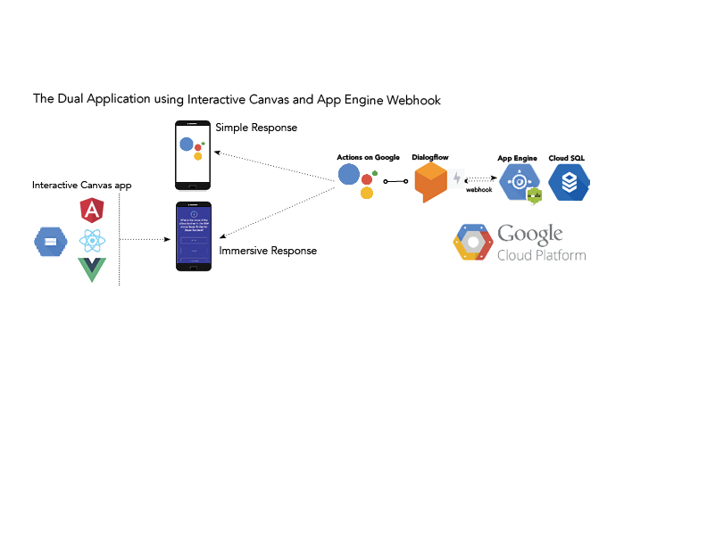
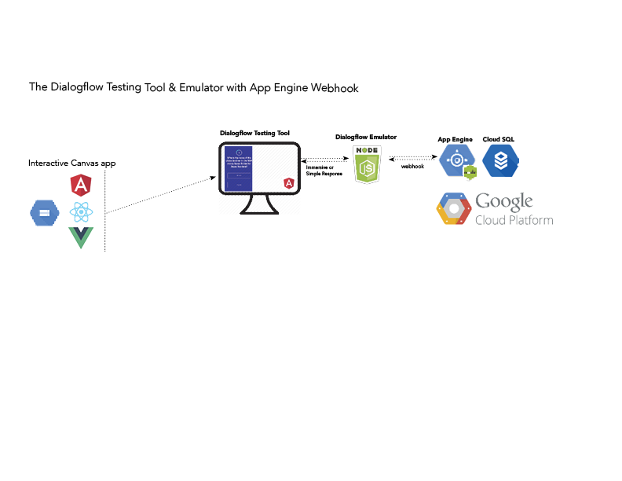

# Dialogflow Testing Tool

This respository contains a testing framework that was as part of the creation of an [Interactive Canvas](https://developers.google.com/actions/interactivecanvas/) application using Dialogflow.

Specifically the framework allows purely local testing of the entire application stack, including the Interactive Canvas app and the Webhook/Fulfillment app without having to go through the cloud. This was set-up was found to be extremely useful in debugging issues in the Canvas app and its communication with the backend Fulfillment app.

The repository here contains an Angular 6 app which serves as the front-end of the testing framework. Among other things it furnishes an emulator for both the Simple and Immersive surfaces. This front-end app can be run locally but must be used in conjunction with the [Dialogflow Emulator](https://github.com/matthew-trump/dialogflow-emulator), a Node Express server which serves as the local surrogate for Dialogflow itself, and which provides "dumb AI" capabilities for testing purposes. It is possible that both of these components could be placed togther in a monorepository at some point, since they are meant to be used together.

## The Dual Application: Simple and Immersive Responses

This project was generated with [Angular CLI](https://github.com/angular/angular-cli) version 6.2.9.

## Development server

Run `ng serve` for a dev server. Navigate to `http://localhost:4200/`. The app will automatically reload if you change any of the source files.

## Code scaffolding

Run `ng generate component component-name` to generate a new component. You can also use `ng generate directive|pipe|service|class|guard|interface|enum|module`.

## Build

Run `ng build` to build the project. The build artifacts will be stored in the `dist/` directory. Use the `--prod` flag for a production build.

## Running unit tests

Run `ng test` to execute the unit tests via [Karma](https://karma-runner.github.io).

## Running end-to-end tests

Run `ng e2e` to execute the end-to-end tests via [Protractor](http://www.protractortest.org/).

## Further help

To get more help on the Angular CLI use `ng help` or go check out the [Angular CLI README](https://github.com/angular/angular-cli/blob/master/README.md).
